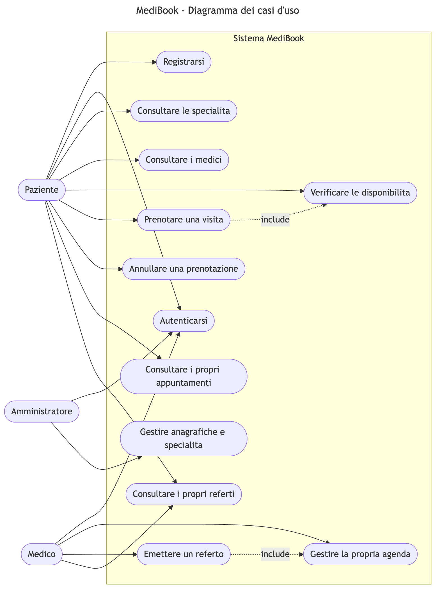
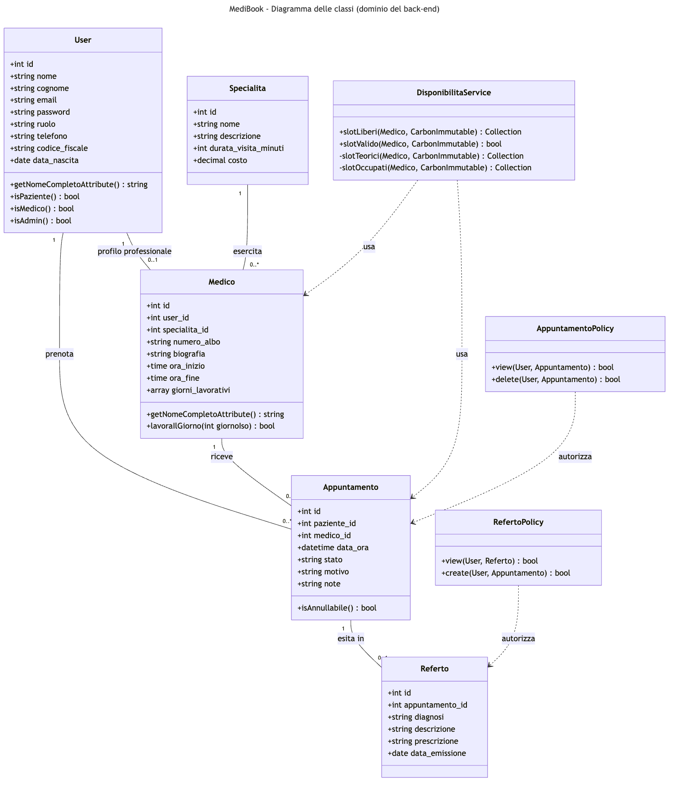
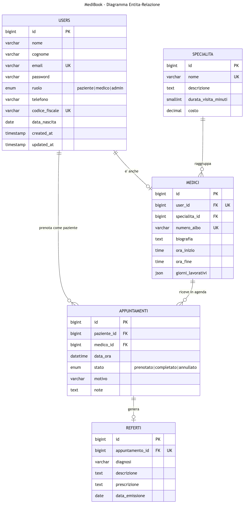

# MediBook

Applicazione full-stack **API-based** per la prenotazione di visite specialistiche e la
gestione dei referti di una clinica privata.

Il progetto è stato realizzato come elaborato del **Project Work n. 16** del Corso di Laurea
in Informatica per le Aziende Digitali (L-31) — tema *La digitalizzazione dell'impresa* —
che richiede lo sviluppo di un'applicazione full-stack basata su API per un'organizzazione
del settore sanitario.

---

## Indice

- [Contesto e obiettivo](#contesto-e-obiettivo)
- [Architettura](#architettura)
- [Tecnologie](#tecnologie)
- [Struttura del repository](#struttura-del-repository)
- [Requisiti](#requisiti)
- [Installazione](#installazione)
- [Utenze dimostrative](#utenze-dimostrative)
- [Documentazione delle API](#documentazione-delle-api)
- [Contratto degli endpoint](#contratto-degli-endpoint)
- [Modello dei dati](#modello-dei-dati)
- [Diagrammi](#diagrammi)
- [Test](#test)
- [Screenshot](#screenshot)
- [Scelte progettuali di rilievo](#scelte-progettuali-di-rilievo)

---

## Contesto e obiettivo

L'organizzazione di riferimento è una clinica privata di medie dimensioni che eroga
prestazioni specialistiche su appuntamento. Prima della digitalizzazione la prenotazione
avviene per telefono o di persona, con code, errori di trascrizione, difficoltà nel reperire
gli slot liberi e scarsa tracciabilità; i referti sono gestiti su supporto cartaceo.

MediBook digitalizza i due processi più rilevanti:

1. **prenotazione delle visite** — il paziente consulta in autonomia specialità, medici e
   slot liberi e prenota senza vincoli di orario;
2. **gestione dei referti** — il medico emette il referto della visita effettuata e il
   paziente lo consulta in un'area riservata.

## Architettura

Architettura client-server a tre livelli, con separazione netta fra presentazione,
logica applicativa e persistenza. La comunicazione avviene esclusivamente via HTTP/JSON
verso l'API REST: è questo il cuore dell'impostazione API-based, che rende il back-end
riutilizzabile da qualsiasi altro client (app mobile, totem, gestionali di terze parti).

```
┌────────────────────┐     HTTP/JSON      ┌────────────────────┐              ┌─────────┐
│  Front-end React   │  ───────────────▶  │  API REST Laravel  │  ──────────▶ │  MySQL  │
│  (Vite, React      │  ◀───────────────  │  Sanctum, Policy,  │  ◀────────── │         │
│   Router, axios)   │   token Bearer     │  Service, Resource │   Eloquent   │         │
└────────────────────┘                    └────────────────────┘              └─────────┘
```

Il back-end è organizzato per livelli di responsabilità:

| Livello | Componenti | Ruolo |
|---|---|---|
| Rotte | `routes/api.php` | Definizione degli endpoint e dei middleware |
| Controller | `app/Http/Controllers/Api` | Orchestrazione del flusso della richiesta |
| Validazione | `app/Http/Requests` | Form Request: validazione centralizzata |
| Autorizzazione | `app/Policies`, `app/Http/Middleware` | Controlli per ruolo e per proprietario della risorsa |
| Dominio | `app/Services`, `app/Models` | Logica di dominio e accesso ai dati (Eloquent) |
| Rappresentazione | `app/Http/Resources` | Disaccoppiamento fra modello dati e JSON esposto |

## Tecnologie

| Ambito | Scelta |
|---|---|
| Back-end | PHP 8.2+, Laravel 13, Laravel Sanctum |
| Base dati | MySQL 8 (SQLite in fase di test) |
| Front-end | React 19, Vite, React Router, axios, CSS senza framework |
| Documentazione API | OpenAPI 3.0 + Swagger UI |
| Test | PHPUnit (test funzionali sulle API) |

## Struttura del repository

```
medibook/
├── backend/                     # API REST Laravel
│   ├── app/
│   │   ├── Http/
│   │   │   ├── Controllers/Api/ # AuthController, AppuntamentoController, ...
│   │   │   ├── Middleware/      # EnsureUserHasRole
│   │   │   ├── Requests/        # Validazione centralizzata
│   │   │   └── Resources/       # Rappresentazione JSON
│   │   ├── Models/              # User, Specialita, Medico, Appuntamento, Referto
│   │   ├── Policies/            # Autorizzazioni per risorsa
│   │   └── Services/            # DisponibilitaService
│   ├── database/                # Migrazioni, factory, seeder
│   ├── public/docs/openapi.yaml # Specifica OpenAPI
│   ├── routes/api.php           # Contratto delle rotte
│   └── tests/Feature/Api/       # Test funzionali
├── frontend/                    # SPA React
│   └── src/
│       ├── api/client.js        # Client HTTP centralizzato
│       ├── context/             # Stato di autenticazione
│       ├── hooks/               # useApi, useAppuntamenti
│       ├── components/          # Layout, RottaProtetta, Avviso, ...
│       └── pages/               # Home, Login, Prenotazione, Referti, ...
└── docs/
    ├── diagrammi/               # Casi d'uso, classi, ER (Mermaid + PNG)
    └── screenshot/              # Test funzionale documentato
```

## Requisiti

- PHP >= 8.2 con estensioni `pdo_mysql`, `mbstring`, `openssl`
- Composer 2
- Node.js >= 20 e npm
- MySQL 8 (in alternativa SQLite, si veda sotto)

## Installazione

### 1. Back-end

```bash
cd backend
composer install
cp .env.example .env
php artisan key:generate
```

Creare la base dati e configurare le credenziali in `.env`:

```sql
CREATE DATABASE medibook CHARACTER SET utf8mb4 COLLATE utf8mb4_unicode_ci;
```

```bash
php artisan migrate --seed
php artisan serve            # http://localhost:8000
```

> **Prova rapida senza MySQL** — impostare `DB_CONNECTION=sqlite` in `.env`,
> creare il file con `touch database/database.sqlite` e lanciare `php artisan migrate --seed`.

### 2. Front-end

```bash
cd frontend
npm install
cp .env.example .env          # VITE_API_URL=http://localhost:8000/api
npm run dev                   # http://localhost:5173
```

## Utenze dimostrative

Il seeder popola la clinica con 6 specialità, 7 medici e uno scenario completo di
prenotazioni e referti. Tutte le utenze usano la password `password123`.

| Ruolo | Email | Note |
|---|---|---|
| Paziente | `paziente@medibook.test` | Ha una visita futura e un referto già emesso |
| Medico | `giulia.bianchi@medibook.test` | Cardiologia, riceve lun-ven 09:00-17:00 |
| Medico | `sara.ferrari@medibook.test` | Dermatologia, riceve mar e gio 08:30-13:30 |
| Amministratore | `admin@medibook.test` | Utenza di direzione |

## Documentazione delle API

Con il back-end in esecuzione, la specifica OpenAPI è navigabile e testabile
all'indirizzo:

```
http://localhost:8000/api/documentation
```

Il file sorgente della specifica è `backend/public/docs/openapi.yaml`.

## Contratto degli endpoint

| Metodo | Endpoint | Autenticazione | Descrizione |
|---|---|---|---|
| POST | `/api/register` | — | Registrazione di un nuovo paziente |
| POST | `/api/login` | — | Autenticazione e rilascio del token |
| POST | `/api/logout` | token | Revoca del token corrente |
| GET | `/api/me` | token | Profilo dell'utente autenticato |
| GET | `/api/specialita` | — | Elenco delle specialità |
| GET | `/api/specialita/{id}` | — | Dettaglio di una specialità |
| GET | `/api/medici` | — | Elenco dei medici (`?specialita={id}`) |
| GET | `/api/medici/{id}` | — | Dettaglio di un medico |
| GET | `/api/disponibilita` | — | Slot liberi (`?medico={id}&data=AAAA-MM-GG`) |
| GET | `/api/appuntamenti` | token | Agenda dell'utente, paginata |
| GET | `/api/appuntamenti/{id}` | token | Dettaglio di un appuntamento |
| POST | `/api/appuntamenti` | token (paziente) | Prenotazione di una visita |
| DELETE | `/api/appuntamenti/{id}` | token | Annullamento della prenotazione |
| GET | `/api/referti` | token | Elenco dei referti, paginato |
| GET | `/api/referti/{id}` | token | Dettaglio di un referto |
| POST | `/api/referti` | token (medico) | Emissione del referto |

Le risposte adottano i codici di stato HTTP semanticamente corretti
(`200`, `201`, `401`, `403`, `404`, `409`, `422`, `429`) e un corpo JSON coerente;
gli errori di validazione sono restituiti in forma strutturata sotto la chiave `errors`.

## Modello dei dati

| Entità | Descrizione | Relazioni |
|---|---|---|
| `users` | Utente del sistema; il campo `ruolo` generalizza paziente, medico e amministratore | 1–0..1 con `medici`, 1–N con `appuntamenti` |
| `specialita` | Prestazione erogata, con durata e costo della visita | 1–N con `medici` |
| `medici` | Profilo professionale, agenda oraria e giorni di ricevimento | N–1 con `specialita`, 1–N con `appuntamenti` |
| `appuntamenti` | Prenotazione di una visita in uno slot orario | N–1 con `users` e `medici`, 1–0..1 con `referti` |
| `referti` | Esito clinico della visita effettuata | 1–1 con `appuntamenti` |

Sono definiti i vincoli di integrità referenziale, un vincolo di unicità su
`(medico_id, data_ora)` che impedisce la doppia prenotazione a livello di base dati e
gli indici sui campi più interrogati (`ruolo`, `stato`, `specialita_id`, `paziente_id + data_ora`).

## Diagrammi

| Diagramma | Sorgente | Immagine |
|---|---|---|
| Casi d'uso (UML) | [`docs/diagrammi/casi-uso.mmd`](docs/diagrammi/casi-uso.mmd) |  |
| Classi (UML) | [`docs/diagrammi/classi.mmd`](docs/diagrammi/classi.mmd) |  |
| Entità-Relazione | [`docs/diagrammi/entita-relazioni.mmd`](docs/diagrammi/entita-relazioni.mmd) |  |

## Test

La suite copre i casi d'uso principali e i percorsi di errore: autenticazione,
filtri del catalogo, generazione degli slot, prenotazione (slot occupato, fuori orario,
nel passato, ruolo errato), annullamento e autorizzazioni sui referti.

```bash
cd backend
php artisan test
```

```
Tests:    27 passed (62 assertions)
```

I test girano su SQLite in memoria, senza toccare la base dati di sviluppo.

## Screenshot

Il test funzionale dell'interfaccia è documentato in [`docs/screenshot/`](docs/screenshot):

| File | Scenario |
|---|---|
| `01-home.png` | Vetrina pubblica con le specialità della clinica |
| `02-login.png` | Autenticazione del paziente |
| `03-appuntamenti.png` | Elenco delle prenotazioni del paziente |
| `04-disponibilita.png` | Slot liberi del medico nella data scelta |
| `05-conferma.png` | Esito della prenotazione |
| `06-referti.png` | Elenco dei referti del paziente |
| `07-referto.png` | Dettaglio di un referto |
| `08-agenda-medico.png` | Agenda del medico autenticato |
| `09-swagger.png` | Documentazione Swagger UI delle API |

## Scelte progettuali di rilievo

**Prenotazione in transazione con lock pessimistico.** La verifica della disponibilità e
l'inserimento avvengono nella stessa transazione: due richieste concorrenti sullo stesso
slot non possono andare entrambe a buon fine (`409 Conflict`), e il vincolo di unicità in
base dati costituisce la seconda linea di difesa.

**Calcolo delle disponibilità isolato in un servizio.** `DisponibilitaService` genera la
griglia oraria dai dati del medico e della specialità, esclude gli slot occupati e quelli
già trascorsi. La stessa logica è riusata dalla Form Request per validare la prenotazione,
evitando duplicazioni fra consultazione e scrittura.

**Autorizzazioni su due assi.** Il middleware `ruolo` filtra per ruolo dell'utente
(solo un paziente prenota, solo un medico referta); le Policy verificano la proprietà della
singola risorsa (il paziente vede i propri appuntamenti, il medico quelli della propria agenda).

**Disaccoppiamento della rappresentazione.** Le API Resource definiscono esplicitamente i
campi esposti, così che lo schema interno possa evolvere senza rompere il contratto verso
il front-end e senza rivelare dettagli non necessari.

**Client HTTP centralizzato sul front-end.** Un unico modulo incapsula l'indirizzo base
delle API e l'inserimento del token; un interceptor sulle risposte `401` riporta l'utente
al login quando il token scade.

**Annullamento logico.** Le prenotazioni annullate cambiano stato invece di essere
cancellate, preservando lo storico a fini di tracciabilità.

---

## Limiti noti

Il progetto ha finalità dimostrativa e didattica. In un contesto di produzione sarebbero
necessari: piena conformità al GDPR per i dati sanitari (cifratura a riposo, audit log,
gestione del consenso), un controllo degli accessi più granulare, rate limiting esteso,
infrastruttura di scalabilita (caching, bilanciamento, monitoraggio) e una copertura di
test unitari e di integrazione più ampia.
